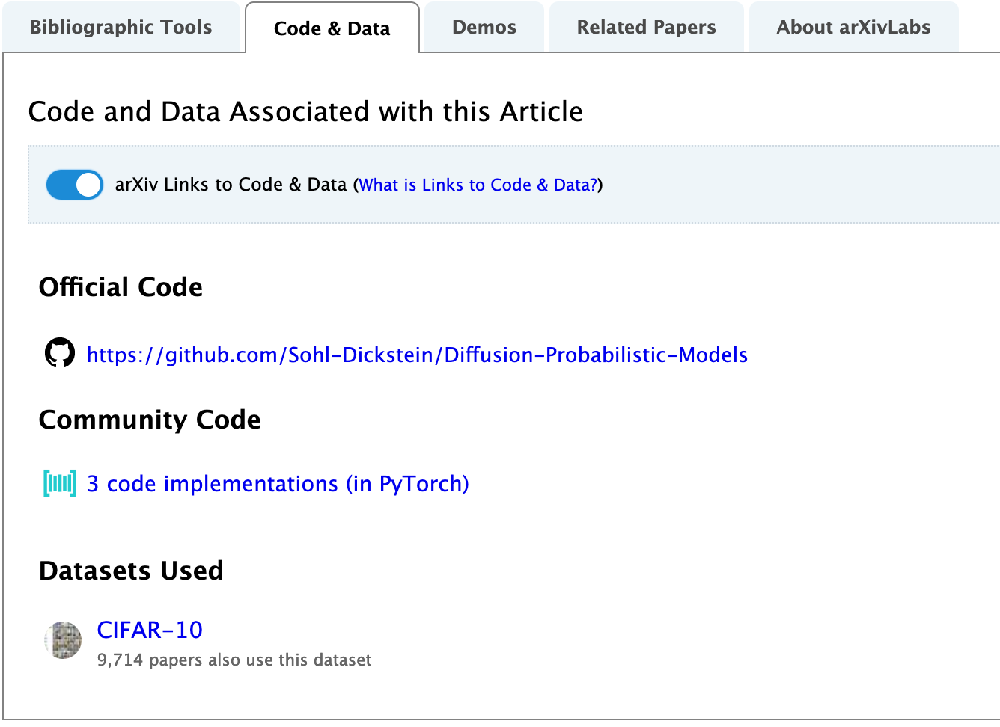

## Week 2 Notes
This is a live document that will be updated based on discussion topics and activities as the week progresses.

### Table of Contents:
- [A.I. Terminology](#ai-terminology)
	- [Models, methods, and training, oh my!](#models-methods-and-training-oh-my)
		- [So how do you train a model?](#so-how-do-you-train-a-model)
			- [General Approaches in Machine Learning:](#general-approaches-in-machine-learning)
	- [Terms that keep coming up...](#terms-that-keep-coming-up)
		- [Further References](#further-references)
- [Engaging With Machine Learning Research](#engaging-with-machine-learning-research)
	- [Where do I find the research?](#where-do-i-find-the-research)
		- [Research Activity:](#research-activity)
- [Tuesday Discussion Notes](#tuesday-discussion-notes)
	- [Data Conscious - Bias in Data](#data-conscious---bias-in-data)
	- [Emergent Properties](#emergent-properties)
	- [Ethical Responsabilities Surrouding AI use](#ethical-responsabilities-surrouding-ai-use)
- [Topics that merit further discussion:](#topics-that-merit-further-discussion)
- [LNN Demo - Basic Math behind Neural Nets](#lnn-demo---basic-math-behind-neural-nets)
	- [Outside topics / readings](#outside-topics--readings)
	- [Data Conscious Discussion:](#data-conscious-discussion)

# A.I. Terminology 

**Artificial Intelligence:** Broad term with cultural significance, ever-shifting and referring to applied, theoretical, and fantastical concepts of Computational Intelligence.

**Machine Learning** is a broad field that explores the design and application of computational systems that are capable of rational problem-solving and/or behavior without explicit instruction (meaning they can adapt to and infer from data) 

All applied ML development focuses on algorithmic and statistical modeling of limited problem-spaces (Artificial Narrow Intelligence). 

## Models, methods, and training, oh my!
Okay, so that is what Machine Learning is about, but what is ***it***?

The final product of a Machine Learning development process is often a **Model**. A model is not a stand alone application or tool, rather it is some code (the core of which is often a single file) that takes specific inputs and parameters (image data, audio data, numerical data, text, etc.) and spits out a specific output (labeled imagery, filtered audio, numerical data groupings, translated text, etc). 

The only difference between a ML model and other forms of code, is that instead of being explicitly written by a human, ML models are ***trained*** (this approach also results in code that looks and behaves very differently under the hood).

Though ML models are often refered to as AI, they are still intentionally crafted by their designers- the model structure, algorithms, parameters, and training data are all curated and often invented by the model's author or other humans. The dataset used in training a model is just as important as the model architecture itself, so you may see the same model architecture trained on a different dataset referred to with a unique name or used for a completely different application.

Okay, so **models** are code, that require **data**, and are generated through **training**... 

### So how do you train a model? 

#### General Approaches in Machine Learning:
Certain pattern-recognition problems lend themselves to particular training techniques. Machine learning problems tend to fall into 1 of 3 camps: Supervised, Unsupervised, or Reinforcement Learning. When you are **training** your model, it is said to be **learning**.

 - **Supervised Learning:**  
	 - *Problem*: Often tries to do something humans already do well, or based on human expertise. 
	 - *Training*: Models are trained from labeled data (usually annotated by a human) and 'learn" a function that best predicts labels for new data. 
	 - *Applications*: Image Identification, Speech Recognition. 
	 - *Popular Algorithm Types*:
		 - Classification (predicting categories)
		 - Regression (predicting a value)
 - **Unsupervised Learning:** 
 	- *Problem*: Often helpful for providing insight into complex data problems which humans struggle to interpret. 
 	- *Training*: Models are trained to identify unknown patterns in data 
 	- *Applications*: Identifying trends in housing market or detecting anomalous credit card activity.
 	- *Popular Algorithm Types*:
		- Clustering (identifying groupings in data) 
		- Association (Identifying rules that associate data points) 
 - **Reinforcement Learning:** 
 	- *Problem*: Helpful for problems humans are not good at defining or problems with limited / state-dependent data.
 	- *Training*:  Model trained through agent interaction with a simulated or real environment - driven by a reward/risk mechanism to alter itself iteravly until it achieves its goal or maximizes its reward. 
 	- *Applications*:  robotics, self-driving cars, game playing AI, etc.
 	- *Popular Algorithm Types*:
		- Monte Carlo
		- Q-Learning
		- Deep Reinforcement Learning

Mind you, these are broad approaches to training models - there are many different sub-components to models, which can be trained via multiple methods and combined in unique ways to solve specific problems.

***Note:***
*Most of what we are discussing during this intensive falls under the category of "Supervised Learning" - simply because there are more opportunities for human input and exploration (data selection, labeling, parameters, subjective evaluation) without getting too into statistics (unsupervised learning) or simulation/hardware (reinforcement Learning). The latter two are equally worthly of study and exploration and there are resources and support for those methods as well.* 

## Terms that keep coming up...
 - **Neural Networks**: A sequence of ML algorithms that are loosely modeled after the brain's neural network ([see 3B1B Video for a refresher](https://www.youtube.com/watch?v=aircAruvnKk))
 - **Deep Learning**: Refers to architectures with multiple/hidden layers (most NN models are Deep Neural Networks)
	 - Deep learning breaks down the feature recognition process and trains that too, allowing for more responsive and fine-tunable models (ex. the MNST NN example).
	- Deep Learning and Neural Networks have been incredibly popular over the past few years, with the increase in mass data and compute power - as they are very computationally intensive to train.
- **Transformers**: Deep Learning Models that leverage parallel computing (think lots of GPU/RAM) to maximize **Long-Short-Term Memory** - this allows for the model to make predictions based on a larger problem context. 
	- This makes transformers very popular for  **Natural Language Processing (NLP)** - where sentence and paragraph context can be factored into things like story generators, making them much more believable (ex. [AIDungeon](https://play.aidungeon.io/))
- **DIffusion Models**: Models trained to remove noise from images. These models were originally designed to solve problems of thermodynamic equilibrium, by"denoise-ing" imagery representing entropy of fluid systems. 
	- This process inadvertently made them good at generating novel images from random noise.
- **Inference**: Is the process of running a model after it has been trained.  Inference is much less computationally intensive than training (in the case of extremely large models such as DALL-E, training is physically impossible on a consumer-grade computer). 
	- Though a model's architecture is set after it is trained, there are still a number of input parameters you can pass along with your data, during **inference** in order to control the final output. You will recall from Week 1 that [playgroundai](https://playgroundai.com/) allowed you to change the output dimensions, the prompt guidance, detail, and other parameters along with your image generation prompt.

### Further References
- [Google ML Glossary](https://developers.google.com/machine-learning/glossary) - clear concise definitions (with visuals) for a range of ML terms (if you come across a term you don't recognize, try looking it up here first)

# Engaging With Machine Learning Research

There are a number of ML driven applications that you already likely use or interact with- Google Translate, Automated Phone Systems, Ring Doorcams, etc. Though these tools use AI technology, you have no control or insight into the inference process.

Last week, when we explored [playgroundai](https://playgroundai.com/)  Text-to-Image generator, we were able to adjust some of the **inference** parameters for either the DALL-E or StableDiffusion  **Model** through a graphical user interface. These tools are fun, but there are limits to what we can do with them, and they still don't provide us with direct access to the **model**.
- What if we wanted to use a faster GPU to process the images? 
- What if we wanted to automate the image generation process and generate hundreds of images based on a list of prompts?
- What if we wanted integrate this model into a larger application or build our own interface?
- What if we want to combine this model with another model to create a novel workflow?

Machine Learning is a unique and fast-moving field, with novel models, approaches, papers being released daily. Luckily, many ML researchers release model code and datasets alongside their papers, so that you can experiment with it yourself. 

## Where do I find the research?
 - [Arxiv - Free Open Access Research Archive](https://arxiv.org/list/cs.AI/recent) - Papers released daily (if you see a ML paper elsewhere on the web, chances are it will redirect here) - Available in PDF, often with links to code, demos, datasets used. 
   -   * 
 - [Github](github.com) - Most research groups or individuals will have their paper's code hosted on github. If you find a paper or project that looks cool - check to see if they have a github, there may be additional resources or projects.
 - [Twitter](twitter.com) ... seriously, the ML research community is very active on Twitter. Impressive projects and papers are shared around quickly. If you start following ML researchers, or folks who engage with AI in a specific domain (business, Art, tech, gaming, policy, philosophy etc.) you will start to see ML discussions, demos, and tools regularly. 
 	- Here are a couple interesting folks to follow, to get you started:
 	    - Research: \@_akhaliq, \@ai_pub
 	    - Application: \@ScottieFoxTTV , \@LumaLabsAI, 
 	    - Critique: \@CriticalAI , \@GiadaPistilli
- [Huggingface.co](https://huggingface.co/) - Research Lab and Increasingly popular repository for ML Models, Datasets, and documentation
  - Attempts to implement best practices surrounding licensing, ethical data use, and bias disclosure
  - Has an active community and discussion spaces to discuss and 
  - Recently integrated with and now hosts Gradio Apps - a ML demo tool, to allow you to quickly develop interfaces for your models.
 
 ### Research Activity:
 1. Start by googling a general AI topic you are interested in (robotics, text-generation, sentiment detection, anything + machine learning etc.)
	- See if there are any news articles that reference more specific idea or technology
 2. Search arxiv, google, twitter - find a paper that looks interesting.
 3. Check to see what resources are associated with the paper (code, datasets, other papers).
 	- Is there a specific model being used? Have people made that model available?
 	- Are there any code or demo notebooks available? 
 	- What datasets are they using? Are those available?
 	- How transparent is this research? Are there any ethical issues with the research or source data?
 4. Summarize your findings to share out
   	
 ***
# Tuesday Discussion Notes

## Data Conscious - Bias in Data
## Emergent Properties
- Complex systems theory
   - Elements in a system that are influenced by each other tend to form groups and complex behaviors that are hard to predict based on constituent elements and initial state
   - NN relationships are similarly difficult to analyze 

## Ethical Responsabilities Surrouding AI use
- Transparency and disclaimers around AI
  - Especially when it's not clear that it's not a human on the other end.
  - A limited solution that is emmerging: Model Cards - disclose bias, ethics, datasets etc. relating to a model (that are becoming a standard)
  - https://www.kaggle.com/code/var0101/model-cards (Description of Model Cards)

# Topics that merit further discussion:
- Gradient of Descent
- Activation Functions

# LNN Demo - Basic Math behind Neural Nets
- Simple Forward Pass Demo (Step by Step Visual) 
  - https://ml4a.github.io/demos/simple_forward_pass/
- Other Neural Netowrk Demos and Tutorials: https://ml4a.github.io/ml4a/
- Recommended Reading for a more detailed understanding of NN, Weights, and Learning Rates. Make your Own Neural Network, Part 1 (little to no math prerequisites) - One of the Provided Texts.
- # Thursday Discussion

## Outside topics / readings

- Upcoming YACHT documentary at PAMCUT (AI generated Lyrics by Ross Goodwin, self-identified "data poet")
  - https://github.com/rossgoodwin/neuralsnap
- The Machine Stops EM Forster 1909 
  - (older text exploring AI/ tech dependence)
  - https://en.wikipedia.org/wiki/The_Machine_Stops

## Data Conscious Discussion:

- Data discussion:
  - LAION-5B
    - taken from "internet" web-crawl
    - private data found in dataset (medical, personal images, violent + graphic imagery) - people implicated concerned
    - artists concerned about their styles being "co-opted" by AI
  - github co-pilot
  - story generation
  - paid services
  - copyright

Is using datasets like LAION5B okay, given those issues?
- AI is just a tool, as long as you give attribution to it or the original dataset, then that's fine.
  - https://www.creativebloq.com/news/ai-art-wins-competition --- shows a painting that won an award at a state fair
- Right now, the people that build the models seem to have all the legal rights at the moment - they have legal rights to control the use of their model, but it was trained with data they did not receive rights to. 
- How can models make sure they are not able to produce output that matches the training data?
  - there are people arguing this is already happening (ex. google copilot)
- AI as copyright laundering. - does the legal structure we currently have serve us in this debate?
- AI as a "hurricane" - ethics and accountability gets lost in the complexity of the process.
  - profit-making on non-consentual data use 
    - "I think profit-making on non-consensual use of data makes it even more gross, but even without profit, it feels exploitive." - Carol
  - large companies have more power in enforcing copyright vs small artists...
  - Science vs Commercial application - standards and expectations are different (intent)
    - Jurassic Park Quote 
    - Norbert Weiner - Scientists have been cynical / upset about the commercialization of science for years
    - We are at an interesting junction - as the "discoveries" in this field are dependent upon "the accumulation of data and experiences of large groups of people"
      - new leaf, opportunity for technology to lead to new good and bad paradigms. 
- As educators, what are the implications of us referencing and building upon these biased or unethically sourced data and models, as the discipline is emerging into public conscousness?
- Concept of "The right to be forgotten" - do we have the right to remove data related to us from permanent records? What happens when you get immortalized.

- Bias / Lack of representation in AI
  - AI is Oriented toward production, capital, speed right now
  - The datasets that are easiest/fastest to build are going to have bias and mis/underrepresentation 
  - https://store.google.com/intl/en/ideas/real-tone/ Here's Google's attempt to address the issue with cameras not capturing black faces/skin well.
  - This new technology is an opportunity as well:
     - Having to use the language of the colonizers... how to could we turn this data into something different (possibility in the training process) "Canibalisers" - Rewrite stories with bias
 - Automating consent of training data?
   - Can we use another model to recognize and flag data that should not be used>?
   - can we embed metadata flags into data?
   - Can we corrupt data? 
   - Data pollution as a future defense against AI alg.
   - How will the public's relationship with data and 
  
 - Narrative is powerful and the responsability of the storyteller.
   - Metamodernism

- Is AI really a tool? or is it something more?
  - Tools and technologies are also the practice that goes along with the thing (use)
  - Scale influences the significance / meaning of AI as a tool
    - LLM is not something that can scale to consciousness...AGI is a different method entirely 