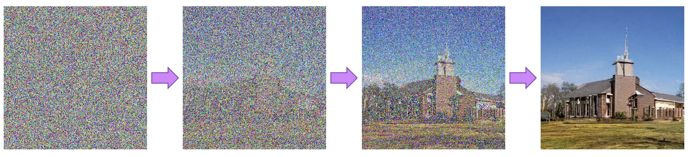
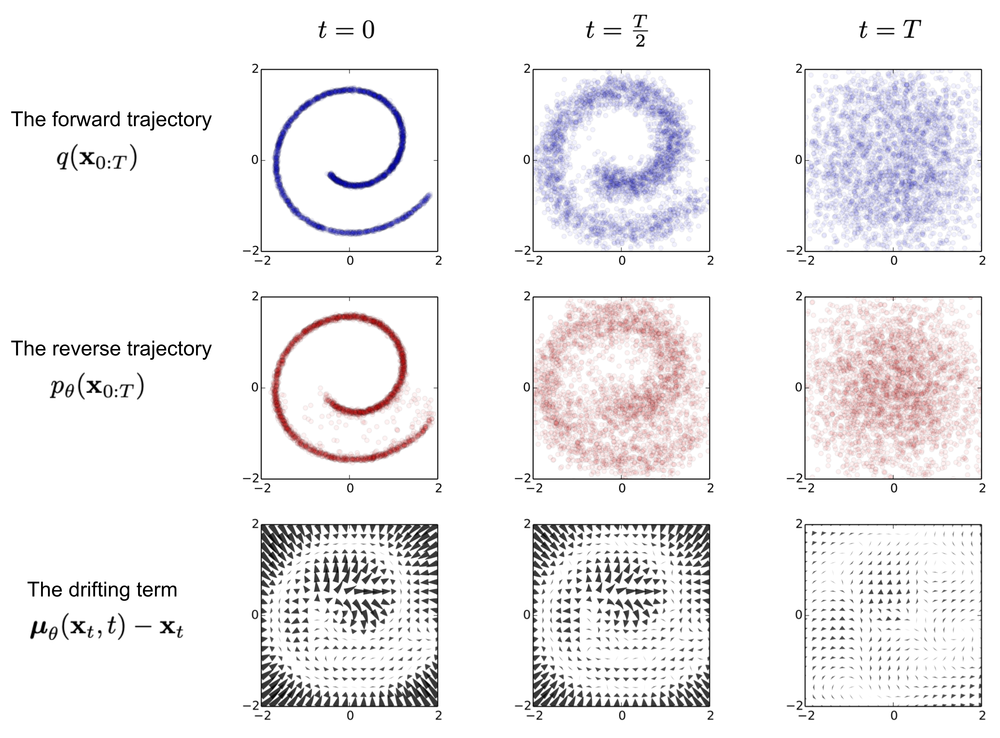
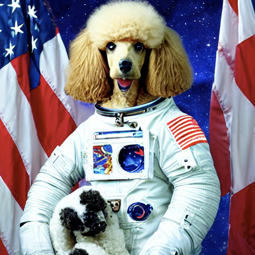
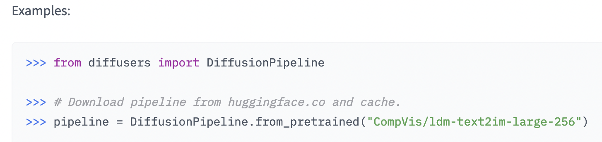
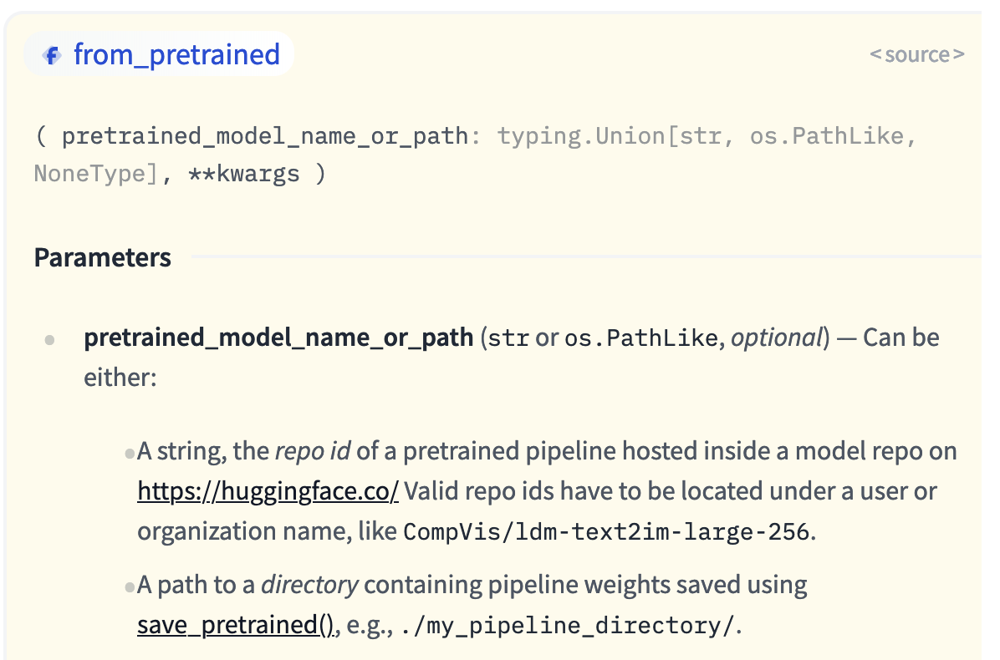
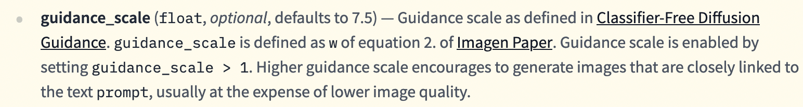

# Stable Diffusion Demos and Activities

### Table of Contents
- [Stable Diffusion Demos and Activities](#stable-diffusion-demos-and-activities)
    - [Table of Contents](#table-of-contents)
- [An AI Model in the Wild: Stable Diffusion](#an-ai-model-in-the-wild-stable-diffusion)
  - [How do diffusion models work?](#how-do-diffusion-models-work)
  - [Foundational Research:](#foundational-research)
  - [Model Released:](#model-released)
    - [Where is it?](#where-is-it)
    - [Prompt Generation Tip Guides](#prompt-generation-tip-guides)
    - [Stable Diffusion vs DALL-E](#stable-diffusion-vs-dall-e)
- [Diffusion Image Generator Demo Activity](#diffusion-image-generator-demo-activity)
  - [Diffusers Library](#diffusers-library)
    - [Stable Diffusion Demo Notebooks](#stable-diffusion-demo-notebooks)
  - [Stable Diffusion Activity Notebook](#stable-diffusion-activity-notebook)
    - [Methods:](#methods)
    - [Notebook Contents:](#notebook-contents)
      - [This week](#this-week)
      - [Next week](#next-week)
      - [Beyond](#beyond)
  - [STEP 0 - Setting Up](#step-0---setting-up)
  - [STEP 1 - Loading Pretrained Model](#step-1---loading-pretrained-model)
  - [STEP 2 - generating images with more control](#step-2---generating-images-with-more-control)
    - [2a.  Set the random seeds](#2a--set-the-random-seeds)
      - [Test Replicability](#test-replicability)
    - [2b. Test Influence of STEP value](#2b-test-influence-of-step-value)
    - [2c. Choosing a Good Prompt](#2c-choosing-a-good-prompt)
    - [2d. Choosing a Guidance Scale](#2d-choosing-a-guidance-scale)
  - [STEP 3 - Improving Images of Faces](#step-3---improving-images-of-faces)
  - [STEP 4 - Building a Machine Learning Web App](#step-4---building-a-machine-learning-web-app)
- [Followup questions](#followup-questions)


# An AI Model in the Wild: Stable Diffusion
Stable Diffusion Text to Image Model:


*An image generated by Stable Diffusion based on the text prompt "a photograph of an astronaut riding a horse"*
## How do diffusion models work?

Diffusion models are trained to remove noise from images. These models were originally designed to solve problems in thermodynamics, by"denoise-ing" imagery representing entropy of fluid systems. - This process inadvertently made them good at generating novel images from random noise.


Source : https://colab.research.google.com/github/huggingface/notebooks/blob/main/diffusers/diffusers_intro.ipynb

*"Diffusion models are trained to remove noise from images, so how do we go about doing this? Let's imagine, as an example, that we want to train a diffusion model to create images of cats. We'd start by adding noise to an image of a cat until we could no longer make out the cat. Then, we'd train the model to remove that noise as best we can. When we want to generate a new image, we simply feed our model a bunch of noise and tell it to generate a clean image"* - Abubakar Abid, Building Computer Vision Applications Course

## Foundational Research:
  * [Deep Unsupervised Learning using Nonequilibrium Thermodynamics](https://arxiv.org/abs/1503.03585) (2015) -Early Paper implementing Diffusion 
    * Paper training a model to reconstruct data after it has been diffused "yielding a highly flexible and tractable generative model of the data"
    * 
  * [LAION - Large Scale Artificial Intelligence Open Network](https://laion.ai/) - For a diffusion model to be able to understand text prompts and synthesize a response image, it requires a lot of labeled data. These are the datasets that Stable Diffusion was Trained on (400m to 5 billion images!)
    * [CLIP - Learning Transferable Visual Models From Natural Language Supervision](https://arxiv.org/abs/2103.00020) - Labeling data is a labor intensive task. This data was also labeled with another ML model
      * Q: how might that effect results? what languages were used? were the images under copywrite?
  * [High-Resolution Image Synthesis with Latent Diffusion Models](https://arxiv.org/abs/2112.10752) (Dec, 2021) - introduces effective method of guiding image development in latent space 
    * training and processing occurs in an abstracted form - rather than pixel by pixel (think tensors)
    * improves speed and flexability
* Curious to learn more about the math of Diffusion Models? Check out [Lil'Log's Blogpost](https://lilianweng.github.io/posts/2021-07-11-diffusion-models/)!
* Also, [The Annotated Diffusion] (https://huggingface.co/blog/annotated-diffusion)

## Model Released: 
by StabilityAI under an [OpenRAIL-M License](https://huggingface.co/spaces/CompVis/stable-diffusion-license) on [August 22nd, 2022](https://stability.ai/blog/stable-diffusion-public-release) ... like 1.5 months ago!

### Where is it?

- [Hosted w/ demo on Huggingface](https://huggingface.co/CompVis/stable-diffusion-v-1-4-original) (you can use huggingface libraries to use the model in your own colab code)
  - Demo Here: [Stable Diffusion Space](https://huggingface.co/spaces/stabilityai/stable-diffusion)


- [Available on github](https://github.com/CompVis/stable-diffusion) (you could fork and build your own project with it, or look at what other work this research group is putting out)

### Prompt Generation Tip Guides
- Stable Diffusion Prompt Generator: https://huggingface.co/spaces/Gustavosta/MagicPrompt-Stable-Diffusion
- https://www.howtogeek.com/833169/- how-to-write-an-awesome-stable-diffusion-prompt/amp/
- https://twitter.com/davidad/status/1551143240065228800

### Stable Diffusion vs DALL-E
Stable Diffusion is open source, unlike the other large image generator model that you might have heard of... OpenAI's DALL-E released in 2021 requires you to pay to use their model (despite the company name, which would imply otherwise).

In the 1.5 months that stable diffusion has been out, there have been 4 official version releases, many clones, stand-alone apps, and app integrations.

Because of this, we've seen:
1. Reduction in RAM requirements, compatability with multiple different hardwares (proliferation of variations of the model)
2. Stand Alone Apps and websites (huggingface gradio apps)
3. App integrations with popular commercial tools (ex. Photoshop, Blender, AR)

Because the original model is free and open source, many of these models and tools are likewise free and modifiable. This week, we are going to be exploring some libraries that make it easy for us to build our own Stable Diffusion Image Generator tools and apps!

***


# Diffusion Image Generator Demo Activity

Hugginface.co, [which hosts Stable Diffusion](https://huggingface.co/blog/stable_diffusion), also has its own, well-documented, libraries (remember that libraries are pre-defined code that is bundled and shared so that others may use it in their code) which you can use to build your own programs and applications.

## Diffusers Library 
One of those libraries is specifically for training, tuning, and infering with Diffusion Models: 
- See Diffusers Library documentation Here: https://huggingface.co/docs/diffusers/index

We are specifically going to be using the Huggingface Diffusers library to build a **Machine Learning Pipeline** - remember that models and algorithms can be combined in many ways. They are not in and of themselves ML tools, we have to do some setup and additional coding to actually *use* them.  

For this demo, we are going to be focusing on using the current version of stable diffusion (v1.4) for inference (we will not be training the model, just defining the input parameters)
-  See using [diffusers for inference](https://huggingface.co/docs/diffusers/using-diffusers/conditional_image_generation) documentation to learn more.

### Stable Diffusion Demo Notebooks 
Here is a functional 
[Stable Diffusion Inference Colab Walkthrough](https://colab.research.google.com/github/huggingface/notebooks/blob/main/diffusers/stable_diffusion.ipynb) you can preview to see how stable diffusion inference is deployed using Google Colab + Diffusers Library.
- Try running the code and reading the descriptions. Don't worry if it doesn't all make sense yet, this is mostly to practice the mechanics of running such a notebook.
- Make note of unfamiliar terms, to reasearch later

[General Diffusers Tutorial Walkthrough](https://colab.research.google.com/github/huggingface/notebooks/blob/main/diffusers/diffusers_intro.ipynb) (Optional) Demo Notebook that goes into more details about the diffuser library and how you might use it to leverage models beyond stable diffusion.
***
## Stable Diffusion Activity Notebook

Now that you have seen a notebook running Stable Diffusion, try out this fill-in-the blank stable diffusion project! 
- This project is from [Abubakar Abid's](https://twitter.com/abidlabs) course: Building Computer Vision Applications on CoRise. Learn more about the course [here](https://corise.com/course/vision-applications).
  
### Methods:
There are 3 ways to go about completing this activity (based on programming comfort level).
1.  Copy the [Blank Notebook](https://colab.research.google.com/drive/1XSGK9S_mtRGO4In_PX5wK_aEdUWwl1-x?usp=sharing) and begin working through it - write your own code using the inline tips and suggested documentation (plus a little bit of googling)
2. Copy the [Blank Notebook](https://colab.research.google.com/drive/1XSGK9S_mtRGO4In_PX5wK_aEdUWwl1-x?usp=sharing) and use the steps below when you get stuck on certain code cells / steps - will be updated based on user questions/comments.
3. Copy this already [Completed Notebook](https://colab.research.google.com/drive/1a8V2f2VDi3eCFhHp6iJP0VBjr-nj4h-s?usp=sharing) - follow along, running each cell and reading linked materials - think about what the program is doing.

*As you work through the notebook, take note of unfamiliar terms, technical challenges and questions you have, so that we may discuss them in Slack.*

### Notebook Contents:
**Please focus on completing the first 2 Steps of the notebook this week**
#### This week
- Introduction
- Step 0: Hardware Setup & Software Libraries
- Step 1: Loading a Pretrained Diffusion Model
- Step 2: Generating Images with Diffusion Models
    - 2a. Setting the random seeds
    - 2b. Setting the number of steps to generate the image
    - 2c. Choosing a Good Prompt
    - 2d. Choosing a Guidance Scale
#### Next week 
- Step 3: Improving Images of Faces - add another model
- Step 4: Building a Machine Learning Web App - share your app
- Step 5: Collecting Data to Improve the Model - allow feedback
#### Beyond
- Bonus: Extensions - Additional proejct enhancement

***
## STEP 0 - Setting Up

- Save the notebook to *your* Google Account, otherwise you will be unable to save your edits
   - **This would also be a good place for you to practice maintaining your code on github - create a new repo on your github account and copy your notebook to it**
- Make sure you have a huggingface account (you will need this when you are asked to consent to model terms and to generate a write token)

## STEP 1 - Loading Pretrained Model

Task: Generate and display 3 more images...
  - Replicate the prompt line
  - Add a **for** loop to generate multiple images
  (you'll notice that running the same code multiple times generates slightly different images)

**Example Code:** (Feel free to use these cells if you get stuck)
  ```python
  prompt = "put your prompt here"
  image_list = []
  for i in range(3):
  image = (pipe(prompt).images[0])
  image_list.append(image)
  display(image_list[i])
  ```

Take note of the **4 tweakable options:**

- "latent noise" matrix (you can fix the seed of the generator, to generate reproducable images)
  -  This allows you to produce the same image each time, for a given prompt (`latents` keyword)
- Adjust number of steps taken: Increases quality slows inference(`num_inference_steps` keyword)
- Prompt text - First positional argument, no keyword needed.
  - Check out recommended readings from this week to learn more about prompt generation.
- Guidance Scale - how closely prompt is followed by the model (`guidance_scale` keyword)
- There is also a scheduler option (adjusts the method of denoising image - won't be used in this demo)

## STEP 2 - generating images with more control

### 2a.  Set the random seeds

```python
import torch
device = torch.device('cuda' if torch.cuda.is_available() else 'cpu')
generator = torch.Generator(device=device)

seed = generator.seed()
print(f"The seed for this generator is: {seed}")
```

Generate a random Tensor:
```python
# generator = torch.Generator() # use this line if getting 'cuda' error
tensor1 = torch.randn((1,4,64,64),generator = generator.manual_seed(seed))
tensor2 = torch.randn((1,4,64,64),generator = generator.manual_seed(seed))
# confirm generator produces the same tensor with fixed seed
display(torch.equal(tensor1, tensor2))
# save fixed seed generator for further use
generator_fixed = generator.manual_seed(seed)
```

Then apply fixed generator:

```python
noise_matrix = torch.randn((1,4,64,64),generator = generator.manual_seed(seed))

# run same code again, but include the constant noise_matrix when calling the model pipe
prompt = "a photo of a poodle on an astronaut"
image_list = []
for i in range(2):
  image = (pipe(prompt, latents=noise_matrix).images[0])
  image_list.append(image)
  display(image_list[i])
# you should see two identical images....
# if you share the seed value with someone else, they should be able to replicate your results
```

#### Test Replicability

For example, if I give you the seed value of `6421725739674010`
and you plug it into the above code, with this prompt:
`prompt = "a photo of a poodle on an astronaut"`
you should get this exact image:


### 2b. Test Influence of STEP value

Example code:

```python
# add num_inference_steps argument to pipe() function call (increase by 5 each time)
step_images = []
for i in range (20):
    steps = int(5*i+1)
    image = (pipe(prompt, latents=noise_matrix, num_inference_steps = steps).images[0])
    step_images.append(image)
    display(step_images[i])
    display(f"Steps ")
```

### 2c. Choosing a Good Prompt

Display the results of at least 5 different prompts:
(Note, this example does not use a fixed seed, but you can add one if you like)
```python
p1 = "Prompt 1"
p2 = "Prompt 2"
p3 = "Prompt 3"
p4 = "Prompt 4"
p5 = "Prompt 5"

movie_prompts = [p1,p2,p3,p4,p5]

# generate 5 images per prompt
for m_prompt in movie_prompts:
  for i in range(1):
    image = (pipe(m_prompt, num_inference_steps = 50).images[0])
    image.save(f"{m_prompt}_v{i}.png")
    display(image)
    display(f"Prompt: {m_prompt}")
```

### 2d. Choosing a Guidance Scale
Select a specific poster prompt and seed to test, then iterate through guidance scale values 2 - 21
```python
seed_value = 6703136330805487 #pick your own seed
m_prompt = p4
for i in range(2,21,3):
    noise_matrix = torch.randn((1,4,64,64),generator = generator.manual_seed(seed_value))
    image = (pipe(m_prompt, latents=noise_matrix, num_inference_steps = 50, guidance_scale=i).images[0])
    image.save(f"{m_prompt}_v{seed_value}.G{i}.png")
    display(image)
    display(f"Prompt: {m_prompt}, Seed number: {seed_value}, Guidance Scale = {i}")
```

## STEP 3 - Improving Images of Faces
Use the GFP-GAN model to improve faces in poster

```python
import requests
import base64
import os
import gradio as gr

def improve_image(img, factor):
  encoded_img = gr.processing_utils.encode_pil_to_base64(img)
  URL = #Enter URL of GFPGAN API
  PARAMS = {"data": [encoded_img, factor]}
  improved_b64 = requests.post(url = URL, json = PARAMS).json()["data"][0]
  improved_img = gr.processing_utils.decode_base64_to_image(improved_b64)
  return improved_img

# uncomment to test above code 
# m_prompt = "Movie Prompt"
# noise_matrix = torch.randn((1,4,64,64),generator = generator.manual_seed(6703136330805487)) 
# image = (pipe(m_prompt, latents=noise_matrix, num_inference_steps = 50, guidance_scale=5).images[0]) 
# improved_image = improve_image(image,3)
# display(improved_image)
```

## STEP 4 - Building a Machine Learning Web App

.... To be continued


# Followup questions

- How do I find a model to use?
    
    - Look at papers and articles demonstrating an interesting application - they will often link to their model if it is hosted on github or huggingface.
    - If you find a model you want to use, see if it has a page / data card on huggingface
        - this will often have demo code and best practices, as well as links to other peoples projects who use this model, so you can see how others apply it.
- How do I learn what parameters I can enter, to manipulate/adjust a pretrained model (for example, the values we tweaked in this demo notebook)
    
    - This is a problem that you will run into when running other peoples' code in general. Recall at the top of the notebook where we installed a bunch of "stuff" - `transformers huggingface_hub diffusers gradio` are all libraries of code that we used throughout the project. We used functions (blocks of pre-written code) from these libraries, and passed them arguments in order for them to do their job (the stuff in the parenthesis).
    - For example, when we ran `from diffusers import StableDiffusionPipeline` we imported a specific function from the diffusers library (which we installed at the begining) and then used that function in our code.
    - WIth the line `pipe = StableDiffusionPipeline.from_pretrained("CompVis/stable-diffusion-v1-4")` we "called" the `StableDiffusionPipeline()` function and specified that we wanted to use an already trained model with `.from_pretrained()` and then gave it a file path string "argument" that it was expecting`"CompVis/stable-diffusion-v1-4"` . We "knew" to do this, because the library documentation explains how this function should be used ([From diffusers documentation](https://huggingface.co/docs/diffusers/v0.5.1/en/api/diffusion_pipeline#diffusers.DiffusionPipeline))
    - 
    - 
  - ex. search for `torch.rand()` in https://pytorch.org/docs to understand what the arguments we passed to it actually represent
  - ex. search for  `StableDiffusionPipeline()` in https://huggingface.co/docs to find the same documentation shown above.
- A library's documentation should always help you determine what arguments you can include when calling a function. It can also help you better define and describe the problem you are having, if you are stuck and need help from others -  by giving you insight into what terminology and methods are being used by a given library (ex. "I am using `StableDiffusionPipeline()` and am trying to define the `guidance_scale` so that my image is tied very closely to the prompt. I see that the documentation recommends larger numbers, but I don't know what the maximum is. What value should I use?")
- 
