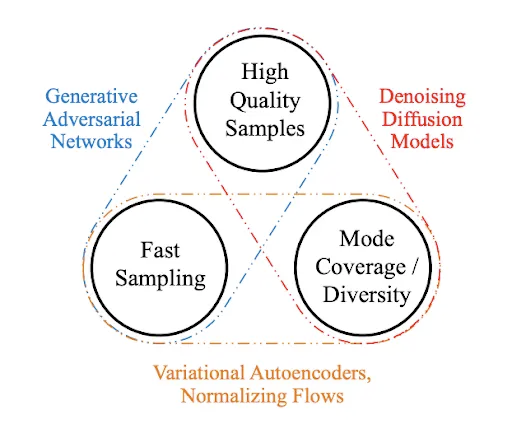

AI Image Generators

# History

2015 - Neural Style Transfer (apply style from one image, to another image)

2014 - Variational Autoencoders (VAEs) - generate images from scratch (used to generate novel "photos" of people for example) (fast and creative, but not realistic/low quality)

2015 - Generative Adversarial Networks (GANs) - the most popular way to generate large images until 2021 ( fast, create realistic images, but less "creative")

2021 - Diffusion Models - Good at generating not just photos, but art and images (ex. DALL-E, Stable Diffusion) - generated by test or image prompt (believable and creative - slower, but getting faster)


## Differences between VAEs, GANs and Diffusion Models

Diagrams of the architectures for GANs, VAEs, flow-based models, and diffusion models

- https://lilianweng.github.io/posts/2021-07-11-diffusion-models/



## How do diffusion models work?

Diffusion models are trained to remove noise from images

Source : https://colab.research.google.com/github/huggingface/notebooks/blob/main/diffusers/diffusers_intro.ipynb

"Diffusion models are trained to remove noise from images, so how do we go about doing this? Let's imagine, as an example, that we want to train a diffusion model to create images of cats. We'd start by adding noise to an image of a cat until we could no longer make out the cat. Then, we'd train the model to remove that noise as best we can. When we want to generate a new image, we simply feed our model a bunch of noise and tell it to generate a clean image"

Diffusion models typically follow UNet architecture - UNet architecture determines pixel size (size can be changed by changing architecture, or can feed image into upscaling NN)

# Diffusers Library

https://huggingface.co/docs/diffusers/index

- has diffusion pipelines that can be run in inference mode ([see using diffusers](https://huggingface.co/docs/diffusers/using-diffusers/conditional_image_generation))
- see all supported pipelines (https://huggingface.co/docs/diffusers/index#pipelines)
- [Schedulers](https://huggingface.co/docs/diffusers/api/schedulers) (generate noise - speed/quality tradeoff)
- multiple model types can be used in diffusion system (see [models](https://huggingface.co/docs/diffusers/api/models))
- Training examples - easy to start with **https://huggingface.co/docs/diffusers/training/overview**

## Getting started

(Example Code)

```python
# make sure you're logged in with `huggingface-cli login`
from torch import autocast
from diffusers import StableDiffusionPipeline

pipe = StableDiffusionPipeline.from_pretrained("CompVis/stable-diffusion-v1-4", use_auth_token=True)
pipe = pipe.to("cuda")

prompt = "a photo of an astronaut riding a horse on mars"
with autocast("cuda"):
    image = pipe(prompt).images[0]
```

- Make sure you are logged in (to use authentication token - CC with conditions of AI-generated art disclosure, no use to spread misinformation,etc)

## Schedulers

- allow you to control the denoising process - number of steps, amount of denoising per step, different denoising techniques (effects quality and speed)
    
- one thing that is cool is that we can "look into" the diffusion process to see what is being developed and decide if we want to continue.
    

## Evaluating an Image Generator

There are not as clear of quantitative metrics for evaluating a image generation model performance (visual inspection can be the quickest/best approach).

There are automated evaluation metrics, ex. "Frechet Inception Distance (FID)"- extracts feature vectors from generation and real images, then fit normal distributions to the vectors and compare the distance between means and SDs across the image sets (Lower = better - in the sense that your image is likely more "realistic")

## Ethical considerations

1.  During training, artist work is scraped w/out consent or compensation
2.  Inference can create misleading imagery, imagery can be presented as not ai-generated.

# Project

[Blank Project 4](https://colab.research.google.com/drive/1XSGK9S_mtRGO4In_PX5wK_aEdUWwl1-x?usp=sharing)

## Notes for introducing project to caicc faculty

https://huggingface.co/blog/stable_diffusion

- simpler tutorial: https://colab.research.google.com/github/huggingface/notebooks/blob/main/diffusers/stable_diffusion.ipynb
- Overview of Diffusion process (with imagery)
    We will be using a model hosted on **huggingface**, initially trained with an extremely large dataset (LAION-2B)
    - look at datacard
        - (huggingface is trying to establish best practices around developing, using, and sharing ML models - they have adopted a datacard format that includes licensing details, the datasets and techniques used to train a given model, as well as noted biases, limitations, and energy use)
        - uses the [Machine Learning Impact Calculator](https://mlco2.github.io/impact#compute)
    - look at files (see components - feature extractor, scheduler, unet- where model is held, see it's post-trained size is only ~3.5gb)
    - look at community (people discussing use and and recommending improvements/changes - huggingface works like github in that it is a repository for code that can be updated and collaborated on - it uses the git protocol just like github)

### STEP 0

- save notebook
- make sure they have a huggingface account and can navigate to find/create at token (with write access)
- consent to terms of model (Scroll and select "Access Repository")

### STEP 1 - Loading Pretrained Model

- need to generate and display 3 more images...
    - replicate prompt line
    - add for loop (save generated images to a list and)
        (you'll notice that running the same code multiple times generates slightly different images)

**4 tweakable options:**

- "latent noise" matrix (you can fix the seed - of randomness, to generate reproducable images, would produce the same image each time, for a given prompt) `latents`
- adjust number of steps taken: `num_inference_steps` (relates to quality)
- prompt (https://www.howtogeek.com/833169/how-to-write-an-awesome-stable-diffusion-prompt/)
- the guidance scale( how closely prompt is followed - ex "creativity") `guidance_scale`
- also - the scheduler (method of denoising image)

### STEP 2 - generating images with more control

#### 2a Set the random seeds

```
- generate random Tensor  (use following code) 
```

```python
generator = torch.Generator() # was getting CPU expected error when using 'cuda' device
tensor1 = torch.randn((1,4,64,64),generator = generator.manual_seed(seed))
tensor2 = torch.randn((1,4,64,64),generator = generator.manual_seed(seed))
# confirm generator produces the same tensor with fixed seed
display(torch.equal(tensor1, tensor2))
# save fixed seed generator for further use
generator_fixed = generator.manual_seed(seed)
```

Then apply fixed generator:

```python
noise_matrix = torch.randn((1,4,64,64),generator = generator.manual_seed(seed))

# run same code again, but include the constant noise_matrix when calling the model pipe
prompt = "a photo of a poodle on an astronaut"
image_list = []
for i in range(2):
  image = (pipe(prompt, latents=noise_matrix).images[0])
  image_list.append(image)
  display(image_list[i])
# you should see two identical images....
# if you share the seed value with someone else, they should be able to replicate your results
```

### Test Replicability

For example, if I give you the seed value of `6421725739674010`
and you plug it into the above code, with this prompt:
`prompt = "a photo of a poodle on an astronaut"`
you should get this exact image:


#### 2b Test Influence of STEP value

example code:

```python
# add num_inference_steps argument to pipe() function call (increase by 5 each time)
step_images = []
for i in range (20):
    steps = int(5*i+1)
    image = (pipe(prompt, latents=noise_matrix, num_inference_steps = steps).images[0])
    step_images.append(image)
    display(step_images[i])
    display(f"Steps ")
```

# Followup questions

- How do I find a model to use?
    
    - Look at papers and articles demonstrating an interesting application - they will often link to their model if it is hosted on github or huggingface.
    - If you find a model you want to use, see if it has a page / data card on huggingface
        - this will often have demo code and best practices, as well as links to other peoples projects who use this model, so you can see how others apply it.
- How do I learn what parameters I can enter, to manipulate/adjust a pretrained model (for example, the values we tweaked in this demo notebook)
    
    - This is a problem that you will run into when running other peoples' code in general. Recall at the top of the notebook where we installed a bunch of "stuff" - `transformers huggingface_hub diffusers gradio` are all libraries of code that we used throughout the project. We used functions (blocks of pre-written code) from these libraries, and passed them arguments in order for them to do their job (the stuff in the parenthesis).
    - For example, when we ran `from diffusers import StableDiffusionPipeline` we imported a specific function from the diffusers library (which we installed at the begining) and then used that function in our code.
    - WIth the line `pipe = StableDiffusionPipeline.from_pretrained("CompVis/stable-diffusion-v1-4")` we "called" the `StableDiffusionPipeline()` function and specified that we wanted to use an already trained model with `.from_pretrained()` and then gave it a file path string "argument" that it was expecting`"CompVis/stable-diffusion-v1-4"` . We "knew" to do this, because the library documentation explains how this function should be used ([From diffusers documentation](https://huggingface.co/docs/diffusers/v0.5.1/en/api/diffusion_pipeline#diffusers.DiffusionPipeline))
    - 
    - 

\- ex. search for `torch.rand()` in https://pytorch.org/docs to understand what the arguments we passed to it actually represent
\- ex. search for  `StableDiffusionPipeline()` in https://huggingface.co/docs to find the same documentation shown above.
\- A library's documentation should always help you determine what arguments you can include when calling a function. It can also help you better define and describe the problem you are having, if you are stuck and need help from others -  by giving you insight into what terminology and methods are being used by a given library (ex. "I am using `StableDiffusionPipeline()` and am trying to define the `guidance_scale` so that my image is tied very closely to the prompt. I see that the documentation recommends larger numbers, but I don't know what the maximum is. What value should I use?")
- 